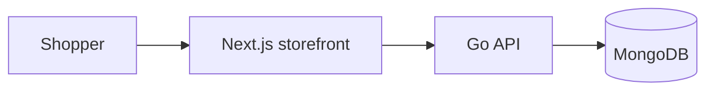
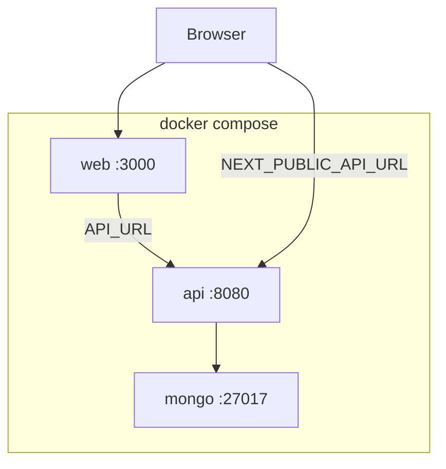
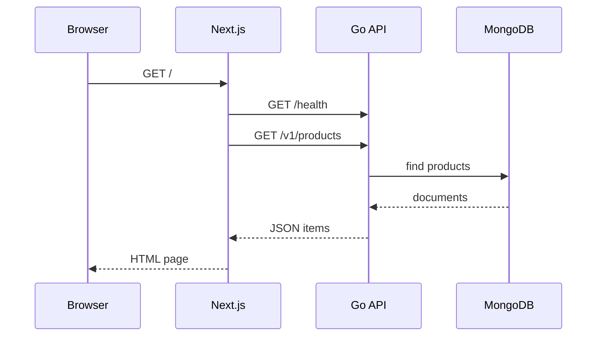

# Diagrams

## System context

```mermaid
flowchart LR
  shopper[Shopper]
  web[Next.js storefront]
  api[Go API]
  db[(MongoDB)]
  shopper --> web
  web --> api
  api --> db
```

## Docker Compose (dev / demo)

```mermaid
flowchart TB
  subgraph compose [docker compose]
    web[web :3000]
    api[api :8080]
    mongo[mongo :27017]
  end
  browser[Browser] --> web
  web -->|API_URL| api
  api --> mongo
  browser -->|NEXT_PUBLIC_API_URL| api
```

## Catalog read sequence

```mermaid
sequenceDiagram
  participant B as Browser
  participant N as Next.js
  participant G as Go API
  participant M as MongoDB
  B->>N: GET /
  N->>G: GET /health
  N->>G: GET /v1/products
  G->>M: find products
  M-->>G: documents
  G-->>N: JSON items
  N-->>B: HTML page
```
